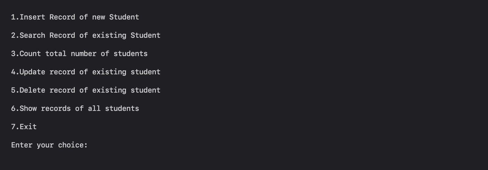
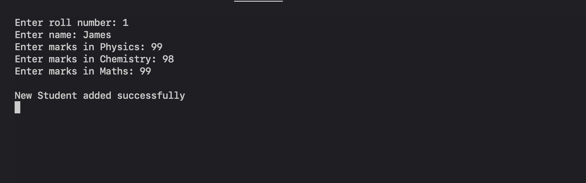
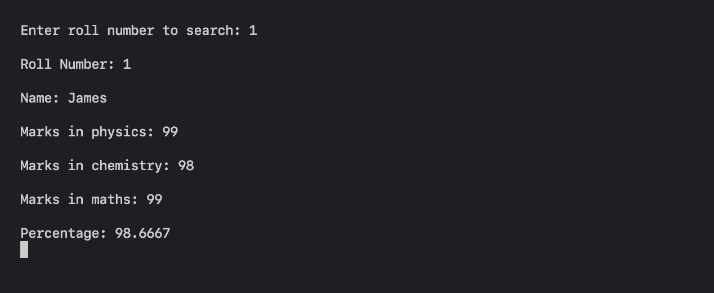
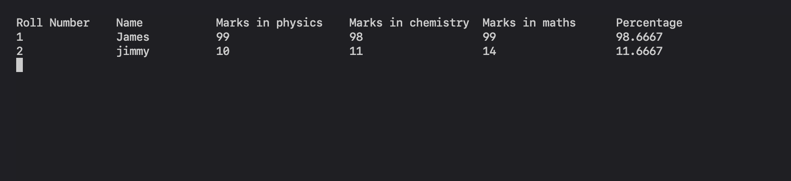

# Student-Management-System

This is a C++ program for managing student records with features such as adding, deleting, updating, and viewing records. Users can input details like Roll Number, name, and marks in physics, chemistry, and maths. The program can also display the current number of enrolled students, helping users keep track of enrollments.

